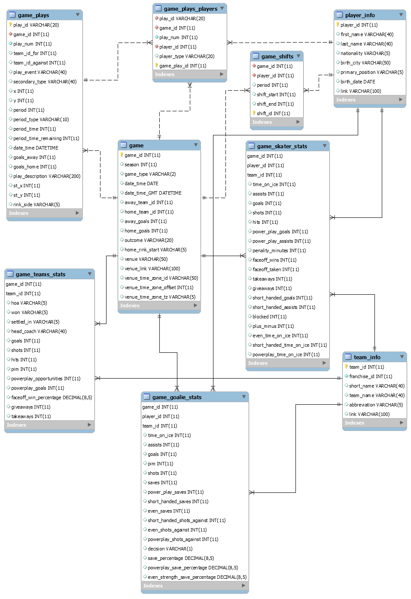
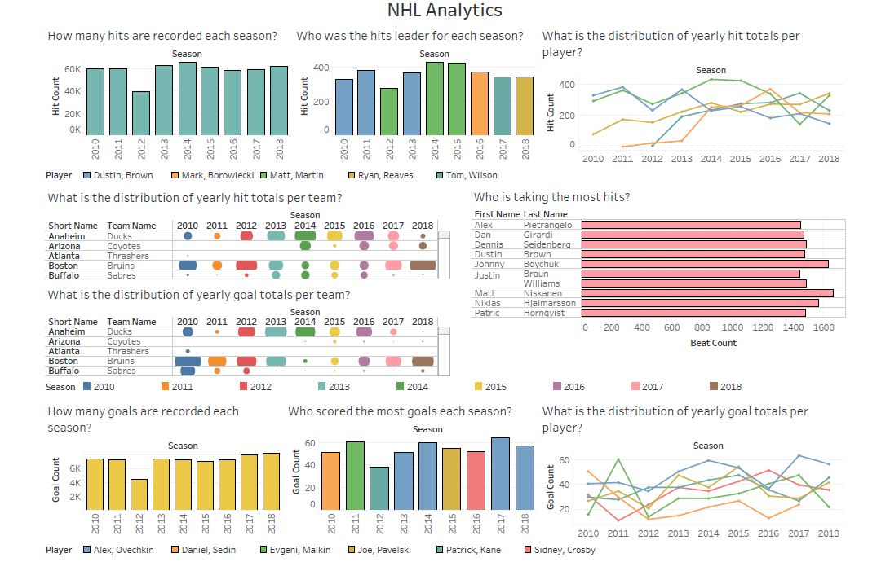

# NHL Database System
The National Hockey League (NHL) is a professional ice hockey league in North America, currently comprising 31 teams: 24 in the United States and 7 in Canada. NHL is considered to be the premier professional ice hockey league in the world and one of the major professional sports leagues in the United States and Canada.   
This project deals with building an automated database which includes all the details of players, teams and matches. Subsequently insights about the NHL database are reported in Tableau. 
## About Data
Download the dataset from [Kaggle](https://www.kaggle.com/martinellis/nhl-game-data).  
The data represents all the official metrics measured for each game in the NHL in the past 6 years. This dataset not only includes the results and player stats of NHL games but also includes details on individual plays such as shots, goals and stoppages including date & time.   
**ER Diagram:**

## Run Commands
`mysql --local-infile=on -u root -p`
### Initial Scripts
**Create Database:** `source scripts/nhl_create_database.sql`  
**Create Tables:** `source scripts/nhl_create_tables.sql`  
**Load Data:** `source scripts/nhl_load_tables.sql`  
**Update Relations:** `source scripts/nhl_update_relations.sql`  
**Verification Queries:** `source scripts/nhl_check_database.sql`
### Analytical Scripts
**Create Views:** `source scripts/nhl_create_views.sql`  
**Analytical Queries:** `source scripts/nhl_query_database.sql`
## Tableau Dashboard

